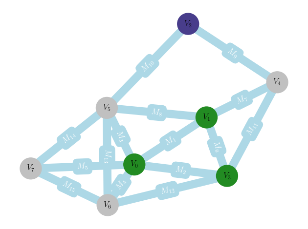
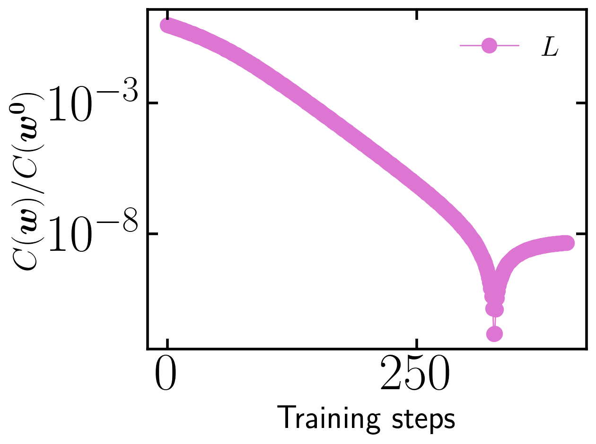

# Multimodal Training in Reconfigurable Brain-Inspired Iontronic Networks

This repository contains the source code used in the study

**"Multimodal Training in Reconfigurable Brain-Inspired Iontronic Networks"**

and provides a simulation framework for training iontronic physical neural networks through geometrical and node-based control variables.

The code is built upon the open-source circuit simulator **ahkab** and extends it with an iontronic memristor model inspired by

> T. M. Kamsma, J. Kim, K. Kim, W. Q. Boon, C. Spitoni, J. Park, and R. van Roij,
> *Brain-inspired computing with fluidic iontronic nanochannels*.

The framework enables the training of iontronic networks using multiple physical modalities, including

* channel length,
* channel base radius,
* salt concentration,
* pressure,

as trainable weights.

---




## Repository Structure

```text
.
├── data/           # Simulation outputs and generated datasets
├── plots/          # Generated figures
├── scripts/        # Example scripts reproducing manuscript results
├── src/            # Core simulation and training modules
├── tests/          # Validation and testing routines
├── .gitignore
└── README.md
```

---

## Installation
This project relies on a modified version of the circuit simulator ahkab that includes an implementation of iontronic memristive nanochannels.

The modified ahkab package can be obtained from: 10.5281/zenodo.20703742

Install the package following the instructions provided in the corresponding repository before running the scripts contained in this project.

After installing the modified ahkab version, install the remaining Python dependencies:


```bash
pip install -r requirements.txt
```

---

## Reproducing the Examples

The `scripts/` directory contains self-contained examples reproducing the main results of the manuscript.

### Voltage Divider Training

```bash
python scripts/voltage_divider.py
```

Trains a simple voltage-divider network and generates:

* network visualization,
* training error evolution,
* trained network dynamics,
* weight evolution.

### Multi-Target Reconfiguration

```bash
python scripts/vd_multiple_targets.py
```

Demonstrates sequential retraining of a voltage-divider network toward different target outputs.

### Input–Output Voltage Mapping

```bash
python scripts/general_network.py
```

Generates and trains a random iontronic network for an input–output voltage mapping task.

### Network Topology Modification

```bash
python scripts/general_network_modify.py
```

Modifies the directionality of memristive channels and evaluates the resulting training performance.

### Linear Regression

```bash
python scripts/linear_regression.py
```

Trains an iontronic network to implement a linear regression function.

### Regression Reconfiguration

```bash
python scripts/linear_regression_retrain.py
```

Demonstrates reconfiguration of a previously trained regression network through an alternative physical control modality.

---

### Tests and Validation
The tests/ directory contains validation and robustness analyses used to verify the implementation and assess the stability of trained iontronic networks.

For example,

python tests/robustness_trained.py
evaluates the robustness of a trained network against experimentally motivated perturbations of the optimized weights and generates the corresponding cost-function distributions.

In addition, the training framework includes a relative_noise option that introduces random fluctuations in the weights at every training step. This feature can be used to investigate how experimentally motivated fabrication uncertainties and control errors affect the training dynamics, convergence behavior, and final network performance. Different perturbation amplitudes can be specified for geometrical and node-based weights, enabling systematic robustness studies under realistic operating conditions.

### Associated Data and Reproducibility Package

The datasets and figure-generation scripts associated with the paper

*Multimodal Training in Reconfigurable Brain-Inspired Iontronic Networks*

are provided in a separate Zenodo repository:

**DOI:** https://doi.org/10.5281/zenodo.20702663

This companion repository contains the processed data used to generate the figures reported in the manuscript, together with the corresponding plotting scripts required for reproducibility.

The present repository provides the simulation engine and iontronic memristor implementation used to generate those datasets.

---

## Scientific Background

The framework investigates the use of iontronic memristive nanochannels as trainable physical neural networks. Unlike conventional implementations, the present approach allows training through multiple physical control variables, including both geometrical properties and externally tunable node parameters.

The repository accompanies the manuscript:

> M. Conte et al.,
> *Multimodal Training in Reconfigurable Brain-Inspired Iontronic Networks*.

---

## Citation

If you use this software in scientific work, please cite:

1. The accompanying manuscript.
2. The original ahkab circuit simulator.

---

## License

This repository contains modifications of the ahkab framework and is distributed under the corresponding open-source license.
